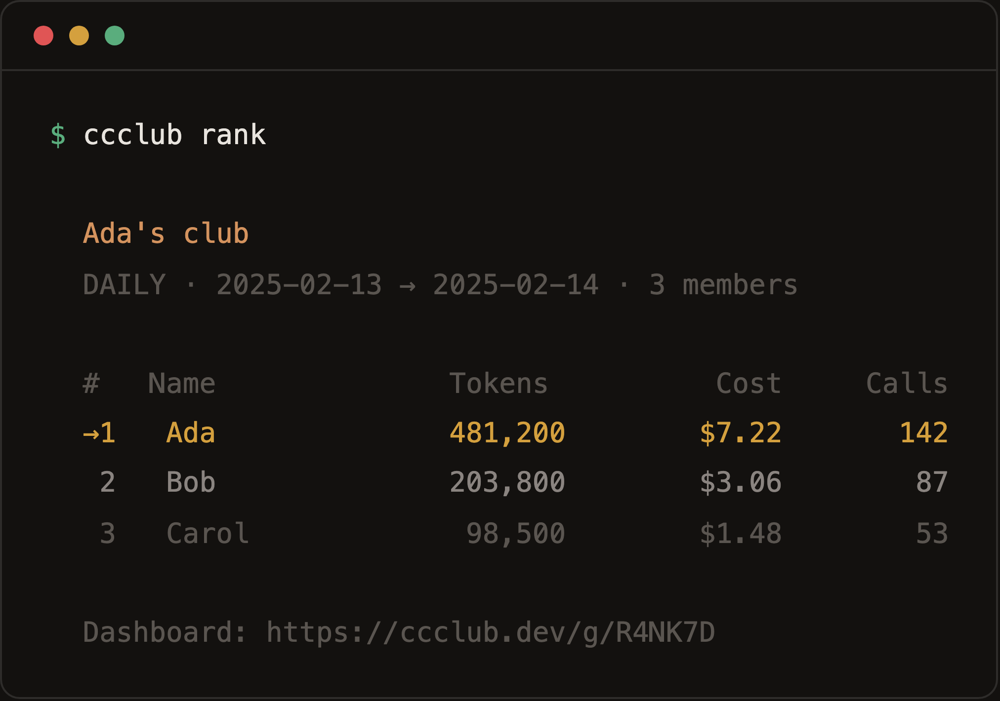

[English](../README.md) | [中文](./README_CN.md) | [한국어](./README_KO.md) | [Deutsch](./README_DE.md) | [Français](./README_FR.md) | [Español](./README_ES.md)

# ccclub.dev

友達が Claude Code をどれだけ使っているか見てみよう。



## はじめに

```bash
npx ccclub init
```

名前を入力すると、6文字の招待コードが発行されます。友達に共有しましょう:

```bash
npx ccclub join R4NK7D
```

以上です。使用量は1時間ごとに自動同期されます。設定不要、登録不要、アカウント不要。

友達が参加したら、リーダーボードを確認：

```bash
ccclub
```

## 仕組み

```
~/.claude/projects/*.jsonl → 1時間ブロックに集約 → アップロード → みんなで見る
```

CCClub は Claude Code がローカルに書き出す JSONL ログを読み取り、1時間ごとの要約（トークン数 + コスト）にまとめてアップロードします。**プロンプト、コード、ファイルパス、プロジェクト名は一切含まれません** — カウンターのみです。`ccclub show-data` で送信内容を確認できます。

## コマンド

日常使いはこの4つだけ:

```bash
ccclub init                        # 初回セットアップ、グループ作成
ccclub join <CODE>                 # 友達のグループに参加
ccclub sync                        # 手動同期（セッション終了時にも自動実行）
ccclub                             # 今日の使用量を表示
```

期間指定:

```bash
ccclub -d 7                        # 過去7日間
ccclub -d 30                       # 過去30日間
ccclub -d all                      # 全期間
ccclub --global                    # 公開ユーザー全員
ccclub -g R4NK7D                   # 特定のグループ
```

その他:

```bash
ccclub create                      # 別のグループを作成
ccclub profile                     # プロフィールを表示
ccclub profile --name "新しい名前"  # 表示名を変更
ccclub profile --avatar "URL"      # カスタムアバター
ccclub profile --public            # グローバルランキングに表示
ccclub profile --private           # グローバルランキングから非表示（デフォルト）
ccclub show-data                   # アップロード内容を確認
```

## Webダッシュボード

各グループにライブページがあります:

```
https://ccclub.dev/g/R4NK7D
```

期間切替（today/7d/30d/all time）、アバター、5分ごとの自動更新。公開ユーザーのグローバルページは `/g/global` にあります。

## プライバシー

アップロードされるのは**これだけ**:

```json
{
  "blockStart": "2025-02-13T00:00:00Z",
  "blockEnd": "2025-02-13T01:00:00Z",
  "inputTokens": 48210,
  "outputTokens": 12050,
  "cacheCreationTokens": 0,
  "cacheReadTokens": 31200,
  "totalTokens": 91460,
  "costUSD": 0.2184,
  "models": ["claude-sonnet-4-5-20250929"],
  "entryCount": 23
}
```

**デフォルトは非公開** — 参加したグループ内でのみ表示されます。グローバルランキングはオプトイン（`ccclub profile --public`）です。

## ライセンス

MIT
